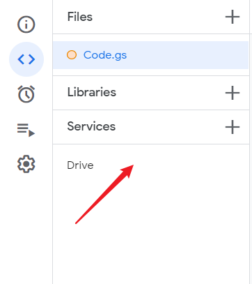

# 须知

+ 本脚本可用于转存 **Google Drive** 文件夹至自己的团队盘或云盘

+ 使用者需要提前注册**google账户**
+ **由于script运行时间限制，最多只能转存200-300个文件**
+ 本人能力尚未成熟，使用时如有问题请反馈并多多包涵

# 食用指南

+ 打开 [Google Apps Script](https://www.google.com/script/start/)，点击 ，使用账户登录进入以下界面

+ 新建项目点击
+ 将项目代码粘贴到编辑器并**保存**，如下
+ 其中folder_link需要填入示范格式，drive_name填入团队盘名称
+ 导入Drive库

成功后示意图如下

+ 点击Run即可运行

